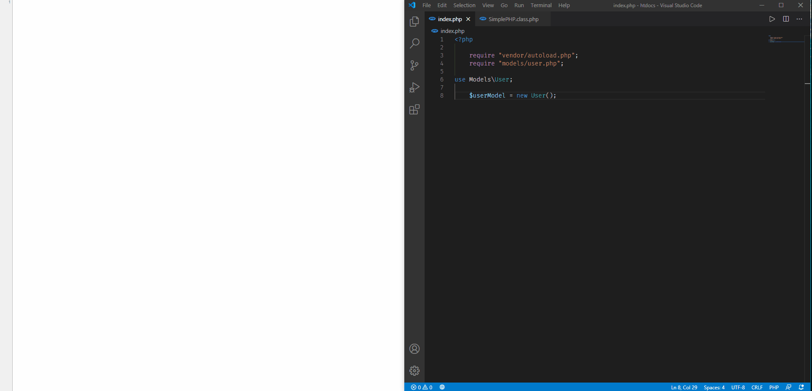

# Simple PHP - Simple and easy CRUD for PHP projects

[](https://github.com/nicollassilva)
[](https://scrutinizer-ci.com/g/nicollassilva/SimplePHP/?branch=master)
[](https://packagist.org/packages/nicollassilva/simplephp)
[](LICENSE)
[](https://github.com/nicollassilva/simplephp/releases)
[](https://scrutinizer-ci.com/g/nicollassilva/SimplePHP/build-status/master)
[](https://scrutinizer-ci.com/code-intelligence)
[](https://packagist.org/packages/nicollassilva/simplephp)

###### Um pequeno projeto CRUD desenvolvido para auxiliar as rotinas diárias e acelerar o processo de comunicação com o banco de dados com segurança e transparência.
A small CRUD project developed to assist daily routines and speed up the process of communicating with the database with security and transparency.



## Getting Started

Some precautions and step-by-step instructions for you to download and install the package.

### Prerequisites

To be able to use **SimplePHP** you will need to have:

```
PHP ^7.2.5
EXT-PDO *
```

### Installing

SimplePHP can be installed via **composer.json** or via the **command terminal**:

```
composer require nicollassilva/simplephp
```

or **composer.json**:

```
"nicollassilva/simplephp": "^1.4"
```

#### Connection

To configure the connection to the database, you must access: **Source\Root\Config.php**.
Example of the file to be found:

```php
protected $config = [
        "driver" => "mysql",
        "hostname" => "localhost",
        "charset" => "utf8",
        "port" => 3306,
        "username" => "root",
        "password" => "",
        "database" => "",
        "timezone" => "America/Sao_Paulo",
        "options" => [
            PDO::ATTR_ERRMODE => PDO::ERRMODE_EXCEPTION,
            PDO::ATTR_CASE => PDO::CASE_NATURAL,
            PDO::ATTR_ORACLE_NULLS => PDO::NULL_EMPTY_STRING
        ]
    ];
```

#### Your model

After completing the database configuration, create a folder at the root of the project where your **Models** will be and create the class. 
* You should extend and use the SimplePHP class namespace, as in the example:

```php
namespace Models;

use SimplePHP\Model\SimplePHP;

class User extends SimplePHP {

    function __construct()
    {
        /**
         * @param string Table Name
         * @param string Primary Key
         */
        parent::__construct('users', 'id');
    }
}
```

* You will need to inherit your model from the SimplePHP class, and in the magic constructor method, call the parent constructor with the name of the table for the referred model, and a primary key.

#### First use

After all the previous steps, create an index.php at the root of the project giving a **require in the composer autoload and in your model class**, after that, instantiate your model and you can start using SimplePHP. Below is an example:

```php
    require "vendor/autoload.php";
    require "models/user.php";

use Models\User;

    $userModel = new User();
    $user = $userModel->find()->execute();
```

### Errors

#### Some mistakes and how to fix them

> Fatal error: Uncaught Error: Class 'SimplePHP\Model\SimplePHP' not found

To fix it, execute the following command in the project's root folder:

```
composer dump -o
```

## Documentation

### Methods

#### find

```php

use Models\User;

$userModel= new User();

/** find all users */
$user = $userModel->find()->execute();

/** find user by id */
$user = $userModel->find(5)->execute();

/** find user with one condition */
$user = $userModel->find()->where('email', 'example@gmail.com')->execute();

/** find user with + conditions */
$user = $userModel->find()->where('name', 'Nícollas Silva')->where('email', 'nicollas@gmail.com')->execute();

/** find users with limit */
$user = $userModel->find()->limit(5)->execute();

/** find users with limit & offset */
$user = $userModel->find()->limit(5)->offset(5)->execute();

/** find users with orderBy */
$user = $userModel->find()->orderBy('id ASC')->execute();

/** find users and return results as attributes. [| Example: $user->name instead of $user['name'] |] */
$user = $userModel->find()->execute(true); 

/** find users with specific columns. */
$user = $userModel->find()->only(['name', 'id', 'email'])->execute();

/** find users creating exceptions in columns. */
$user = $userModel->find(5)->except(['password'])->execute();

```

* **Note:** _except()_ method does not work chained with the _execute(true)_ method, only _execute()_ without parameter true.
* **Note:** _except()_ method only works when looking for specific information, in multidimensional arrays it does not work. This will be fixed soon.

#### destroy

```php
use Models\User;

$userModel = new User();
$user = $userModel->find(3)->execute(true);

    /** @return Exception|bool */
    if($user->destroy()) {
        echo "Success delete!";
    }
```

* **Note:** To delete an information, you need to be aware that there is a reference to that information, that is, the primary key.

#### save (update)

```php
use Models\User;

$userModel = new User();
$user = $userModel->find(5)->execute(true);
$user->name = "Other name";
$user->email = "anyemail@gmail.com";

    /** @return bool */
    if($user->save()) {
        echo "Success!";
    }
```

* **Note:** To save an information, you need to be aware that there is a reference to that information, that is, the primary key.
* **OBS:** You can use the only() method to pull only the necessary information, but when editing, you can pass any column that exists in the database table and the system will proceed to treat and insert it. Example:

```php
use Models\User;

$userModel = new User();
$user = $userModel->find(8)->only(['id', 'name'])->execute(true);
$user->name = "Russian Gabolev";

$user->email = "anyemail@gmail.com";
/** This informations was not called from the database, but they exist. */
$user->updated_at = time();

    /** @return bool */
    if($user->save()) {
        echo "Success!";
    }
```
* **OBS2:** In case of failure, it will return the error code PDOException, if completed, it will return true.

#### create (insert)

```php
use Models\User;

    $userModel = new User();
    $user = $userModel->request([
        "name" => "Dr. Haylie Bahringer",
        "email" => 'hayliebahringer@gmail.com', 
        "password" => 123456 // Encrypt before sending to the database
    ])->create();
```

it is also possible by passing a direct array

```php
use Models\User;

    $userModel = new User();
    $_POST = [
        "name" => "Dr. Haylie Bahringer",
        "email" => "hayliebahringer@gmail.com",
        "password" => 123456 // Encrypt before sending to the database
    ];
    $user = $userModel->request($_POST)->create();
```

* **OBS2:** In case of failure, it will return the error code PDOException, if completed, it will return true.

### Errors

When an error is generated by **SimplePHP**, it will appear in the directory **Source\Logs\Logs.txt** and will **always return null**.
Examples logs:

```
-----SimplePHPLog-----
22/07/2020 12:53:26 -> Error: PDOCode 23000
-------
-----SimplePHPLog-----
22/07/2020 12:53:52 -> The primary index was not found.
-------
```

## Authors

* **Nícollas Silva** - *Developer* - [NicollasSilva](https://github.com/nicollassilva)

## License

This project is licensed under the MIT License - see the [LICENSE.md](LICENSE.md) file for details
